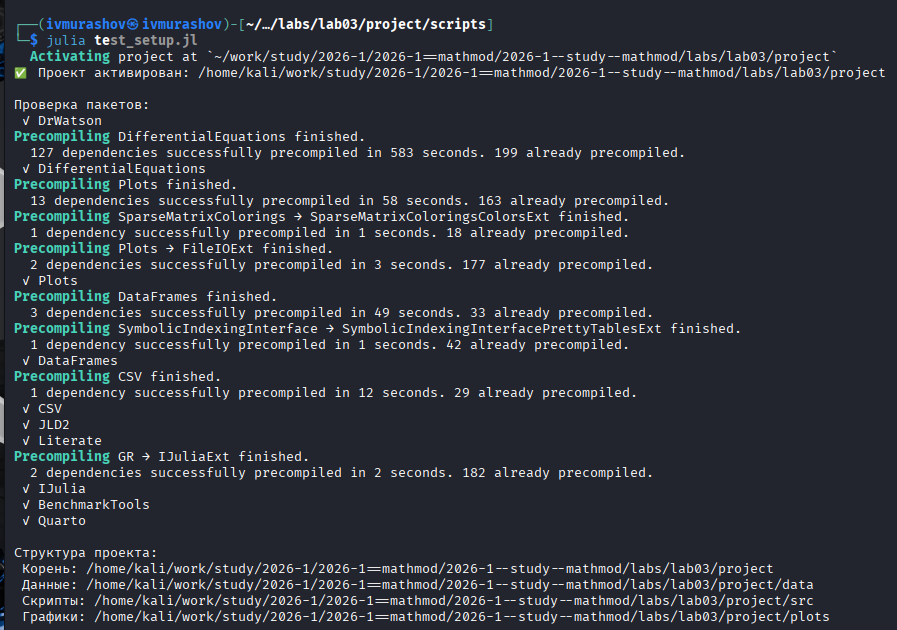
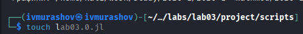
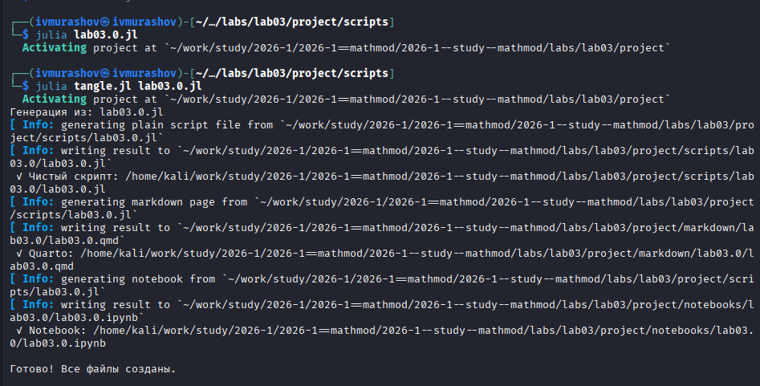
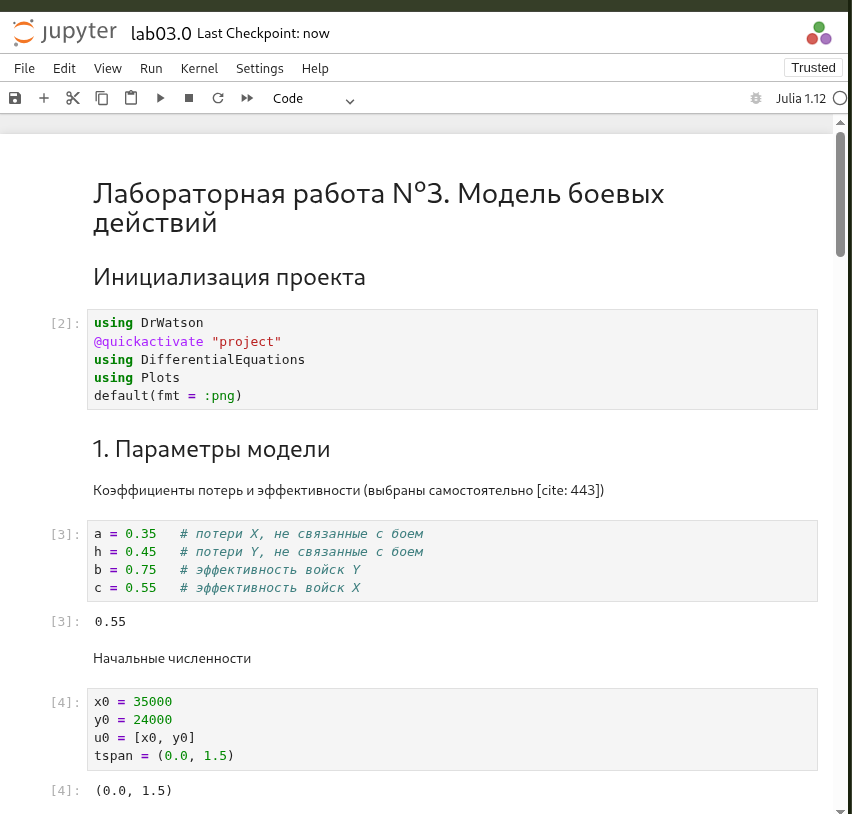
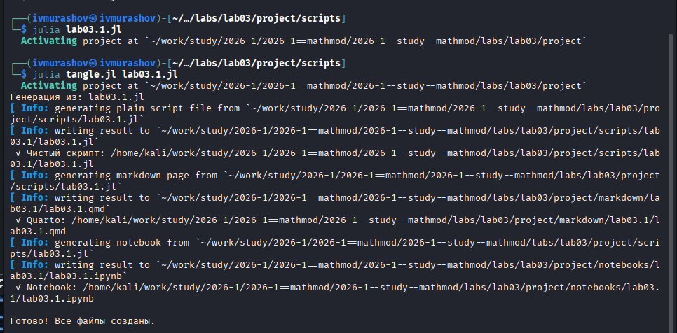
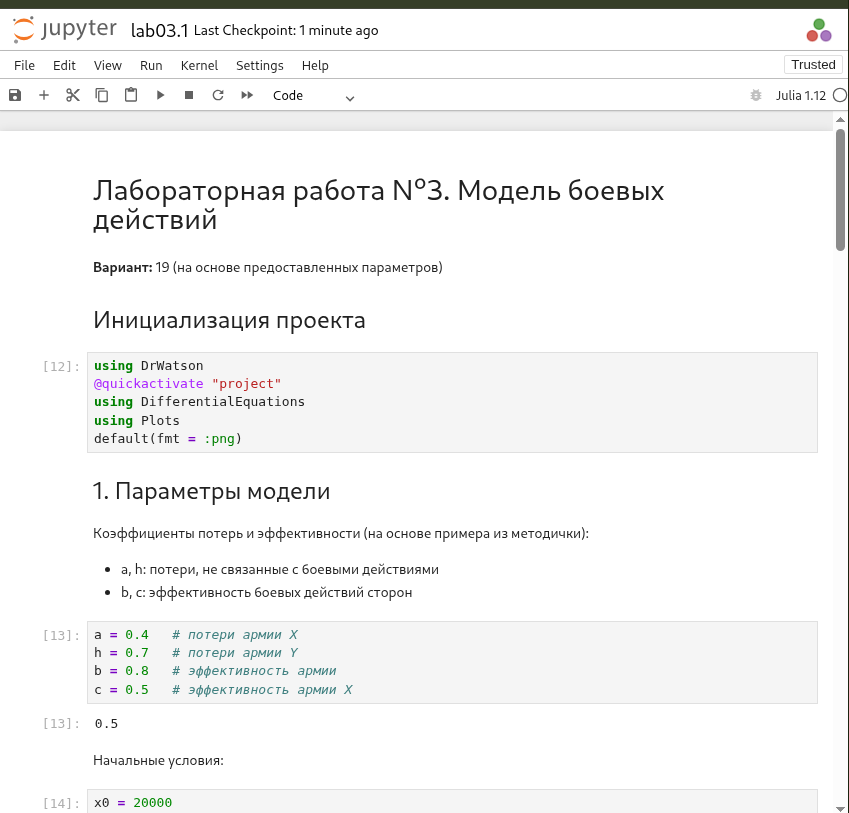

---
## Author
author:
  name: Мурашов Иван Вячеславович
  email: 1132236018@rudn.ru
  affiliation:
    - name: Российский университет дружбы народов
      country: Российская Федерация
      postal-code: 117198
      city: Москва
      address: ул. Миклухо-Маклая, д. 6
## Title
title: Лабораторная работа №3
subtitle: Математическое моделирование
license: CC BY
date: 2026-03-18
date-format: "YYYY-MM-DD"
---

## Цель работы

Целью данной лабораторной работы является изучение простейшей модели боевых действий и построить графики численности войск для различных сценариев противостояния.

## Выполнение лабораторной работы

Создаем и проверяем структуру рабочего каталога project ([рис. @fig-001]).

{#fig-001 width=70%}

## Выполнение лабораторной работы

Создадим файл для решения задачи из лабораторной и создадим производные форматы ([рис. @fig-002], [рис. @fig-003]).

{#fig-002 width=70%}

## Выполнение лабораторной работы

{#fig-003 width=70%}

## Выполнение лабораторной работы

Просмотрим jupyter notebook и запустим его ячейки ([рис. @fig-004]).

{#fig-004 width=70%}

## Выполнение лабораторной работы

Аналогичным образом решаем вторую задачу (Вариант 19) ([рис. @fig-005], [рис. @fig-006]).

{#fig-005 width=70%}

## Выполнение лабораторной работы

{#fig-006 width=70%}

## Выводы

В ходе данной лабораторной работы мной была изучена простейшая модель боевых действий и построены графики численности войск для различных сценариев противостояния.
