---
## Author
author:
  name: Мурашов Иван Вячеславович
  email: 1132236018@rudn.ru
  affiliation:
    - name: Российский университет дружбы народов
      country: Российская Федерация
      postal-code: 117198
      city: Москва
      address: ул. Миклухо-Маклая, д. 6
## Title
title: Лабораторная работа №4
subtitle: Математическое моделирование
license: CC BY
date: 2026-03-31
date-format: "YYYY-MM-DD"
---

## Цель работы

Целью данной лабораторной работы - изучить модель линейного гармонического осциллятора и исследовать его динамику при различных параметрах системы. С помощью специализированного программного обеспечения (язык программирования Julia) построить фазовые портреты и решения для трех сценариев: колебания без затухания, колебания с затуханием и колебания под воздействием внешней гармонической силы.

## Выполнение лабораторной работы

Создаем и проверяем структуру рабочего каталога project ([рис. @fig-001]).

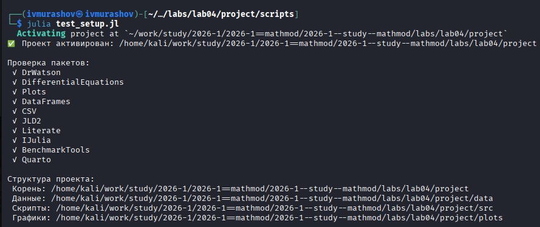{#fig-001 width=70%}

## Задача №1

Создадим файл lab04.0.jl ([рис. @fig-002]).

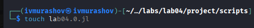{#fig-002 width=70%}

## Задача №1

Запустим скрипт ([рис. @fig-003]).

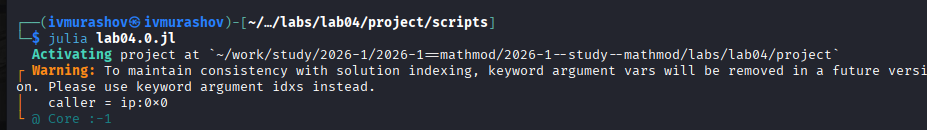{#fig-003 width=70%}

## Задача №1

Создадим производные форматы с помощью скрипта tangle.jl ([рис. @fig-004]).

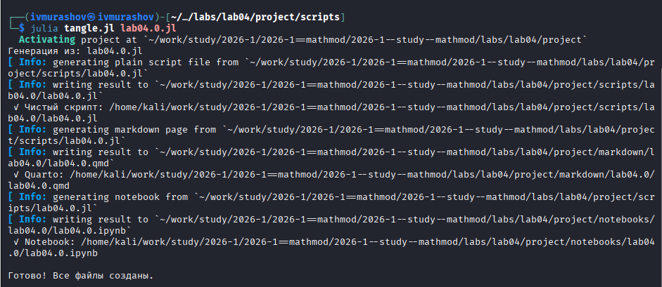{#fig-004 width=70%}

## Задача №1

Запустим файл ipynb в jupyter-notebook ([рис. @fig-005]).

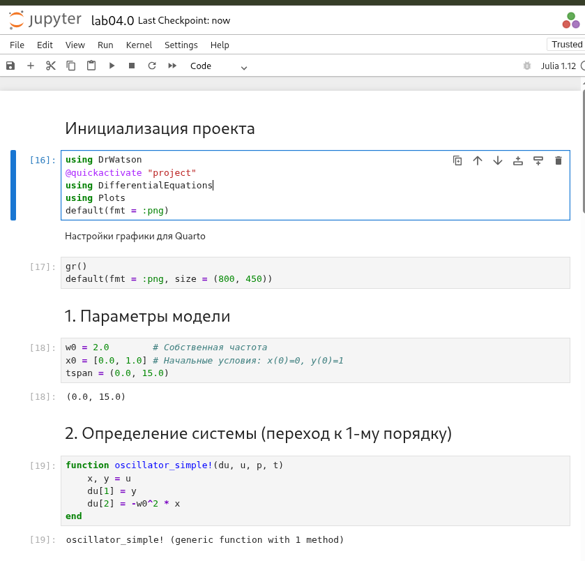{#fig-005 width=70%}

## Задача №2

Создадим файл lab04.1.jl ([рис. @fig-006]).

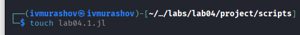{#fig-006 width=70%}

## Задача №2

Запустим скрипт ([рис. @fig-007]).

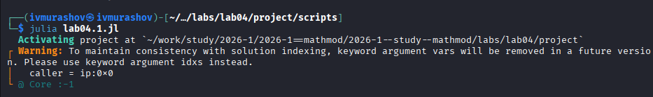{#fig-007 width=70%}

## Задача №2

Создадим производные форматы с помощью скрипта tangle.jl ([рис. @fig-008]).

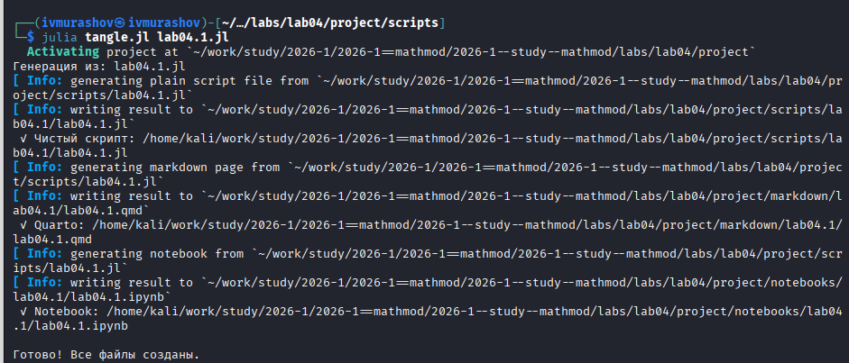{#fig-008 width=70%}

## Задача №2

Запустим файл ipynb в jupyter-notebook ([рис. @fig-009]).

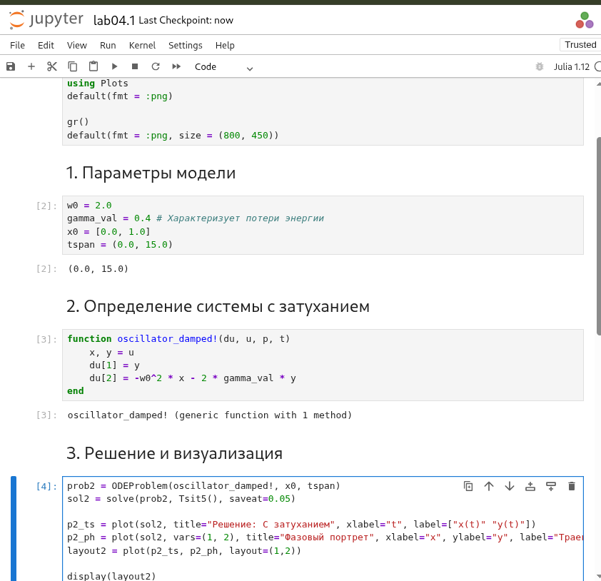{#fig-009 width=70%}

## Задача №3

Создадим файл lab04.2.jl ([рис. @fig-010]).

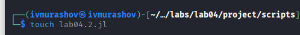{#fig-010 width=70%}

## Задача №3

Запустим скрипт ([рис. @fig-011]).

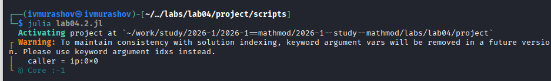{#fig-011 width=70%}

## Задача №3

Создадим производные форматы с помощью скрипта tangle.jl ([рис. @fig-012]).

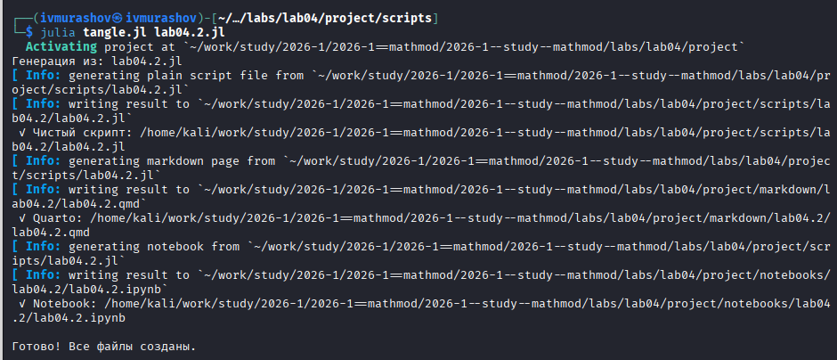{#fig-012 width=70%}

## Задача №3

Запустим файл ipynb в jupyter-notebook ([рис. @fig-013]).

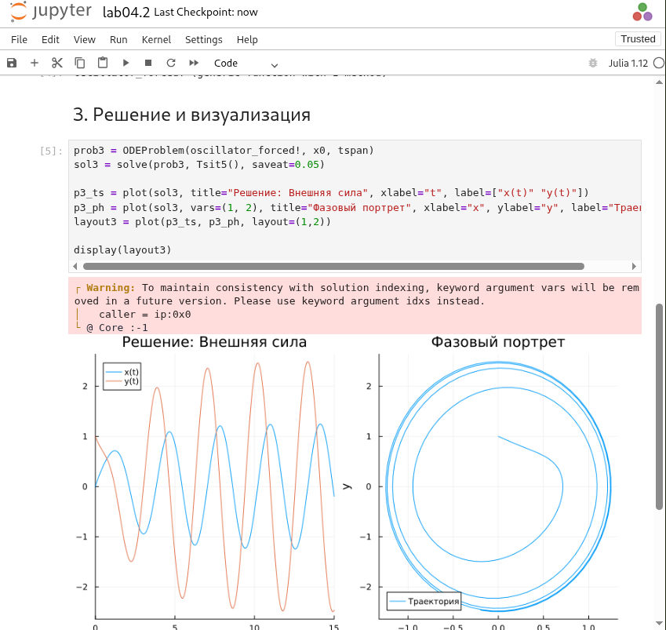{#fig-013 width=70%}

## Выводы

В ходе выполнения лабораторной работы была изучена модель линейного гармонического осциллятора на базе языка программирования Julia и библиотек для численного решения дифференциальных уравнений.
