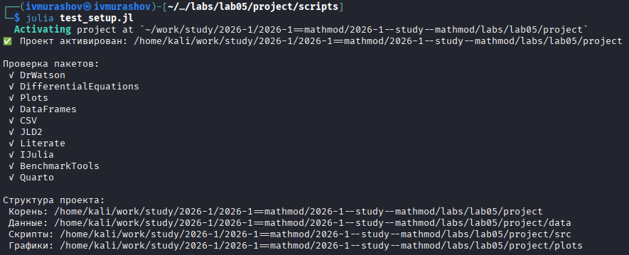
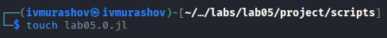
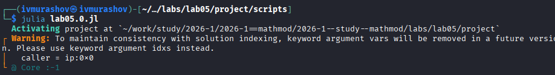
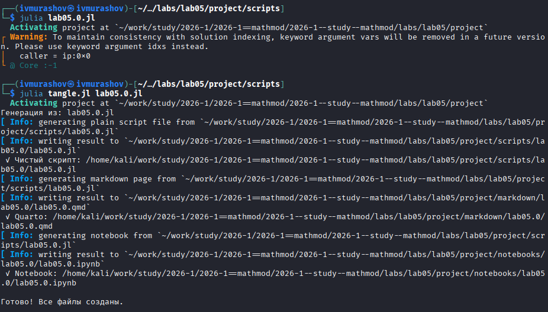
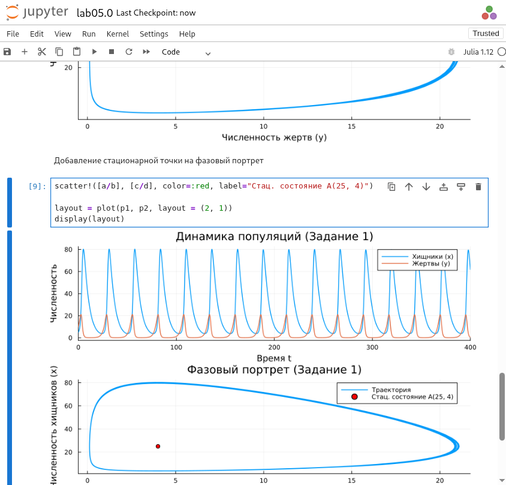
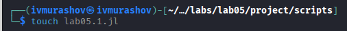
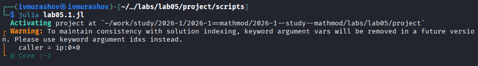
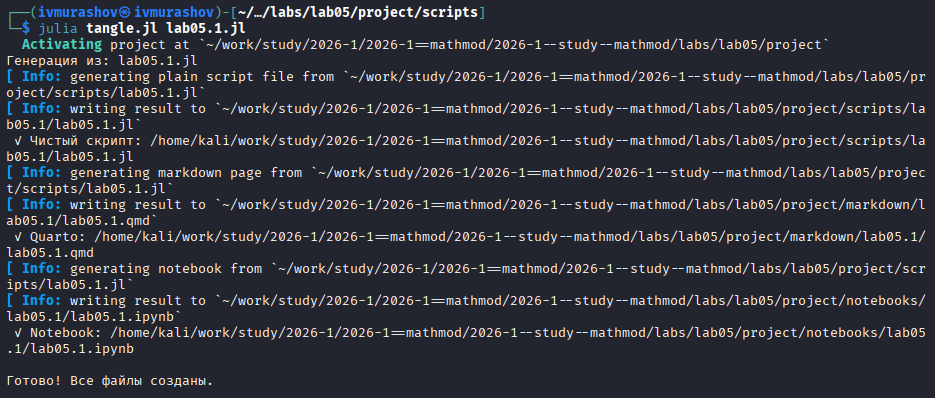
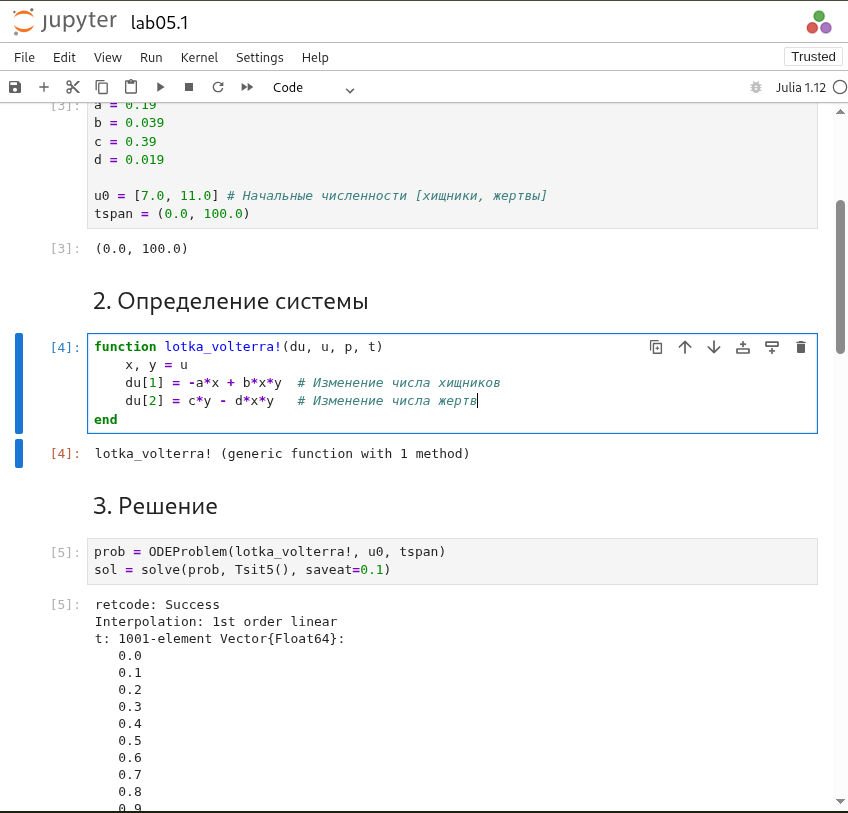

---
## Author
author:
  name: Мурашов Иван Вячеславович
  email: 1132236018@rudn.ru
  affiliation:
    - name: Российский университет дружбы народов
      country: Российская Федерация
      postal-code: 117198
      city: Москва
      address: ул. Миклухо-Маклая, д. 6
## Title
title: Лабораторная работа №5
subtitle: Математическое моделирование
license: CC BY
date: 2026-04-18
date-format: "YYYY-MM-DD"
---

## Цель работы

Целью данной лабораторной работы - изучить жесткую модель взаимодействия двух видов типа «хищник — жертва» (модель Лотки-Вольтерры). С помощью языка программирования Julia провести математическое моделирование системы, построить временные графики колебаний популяций и фазовый портрет системы. Определить влияние коэффициентов смертности и прироста на положение точки стационарного равновесия системы.

## Выполнение лабораторной работы

Создаем и проверяем структуру рабочего каталога project ([рис. @fig-001]).

{#fig-001 width=70%}

## Задача №1

Создадим файл lab04.0.jl ([рис. @fig-002]).

{#fig-002 width=70%}

## Задача №1

Запустим скрипт ([рис. @fig-003]).

{#fig-003 width=70%}

## Задача №1

Создадим производные форматы с помощью скрипта tangle.jl ([рис. @fig-004]).

{#fig-004 width=70%}

## Задача №1

Запустим файл ipynb в jupyter-notebook ([рис. @fig-005]).

{#fig-005 width=70%}

## Задача №2

Создадим файл lab04.1.jl ([рис. @fig-006]).

{#fig-006 width=70%}

## Задача №2

Запустим скрипт ([рис. @fig-007]).

{#fig-007 width=70%}

## Задача №2

Создадим производные форматы с помощью скрипта tangle.jl ([рис. @fig-009]).

{#fig-009 width=70%}

## Задача №2

Запустим файл ipynb в jupyter-notebook ([рис. @fig-010]).

{#fig-010 width=70%}

## Выводы

В ходе выполнения лабораторной работы была изучена и реализована **жесткая модель взаимодействия двух видов «хищник — жертва»** (модель Лотки-Вольтерры). На основе численного анализа, проведенного с помощью языка программирования Julia, сделаны следующие выводы:

* **Периодичность системы**: Математическое моделирование подтвердило основной тезис о том, что в жесткой модели при любых начальных условиях, отличных от равновесных, численность популяций совершает незатухающие периодические колебания.
* **Фазовые траектории**: Построенный фазовый портрет представляет собой замкнутую кривую. Это характерно для консервативных систем, где не учитываются эффекты насыщения и внутривидовая конкуренция.
* **Параметры Варианта №19**: Для заданных коэффициентов стационарное состояние системы (точка равновесия) было определено при значениях $x_0 \approx 20.53$ (хищники) и $y_0 \approx 4.87$ (жертвы).
* **Динамика популяций**: Подтверждено, что колебания численности происходят в противофазе. Рост количества жертв влечет за собой последующий рост числа хищников, что приводит к интенсивному истреблению жертв и закономерному снижению популяции самих хищников из-за сокращения кормовой базы.
* **Структурная устойчивость**: В ходе работы было наглядно показано, что амплитуда и период колебаний в данной модели полностью зависят от начальных значений численностей видов.

Таким образом, работа продемонстрировала механизмы биологического взаимодействия популяций и подтвердила эффективность использования Julia для анализа сложных динамических систем.
