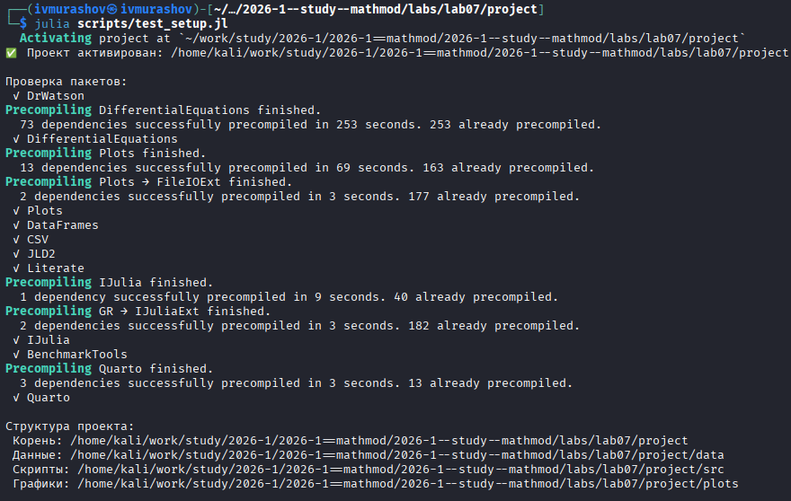
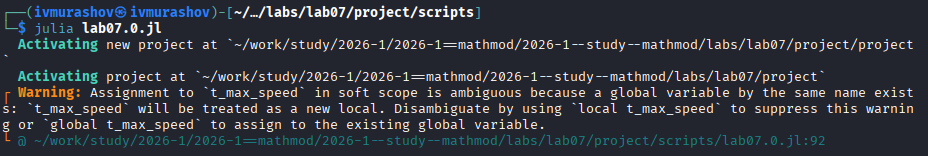
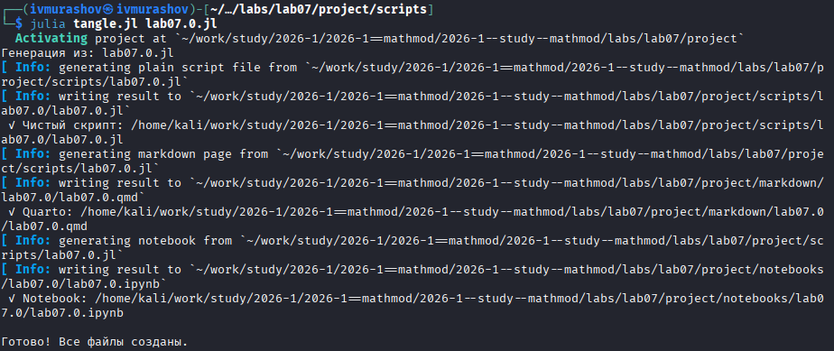
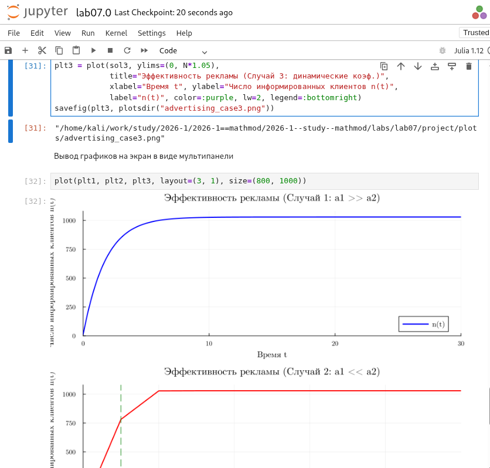
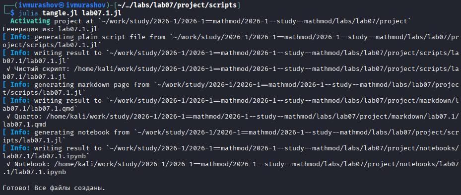
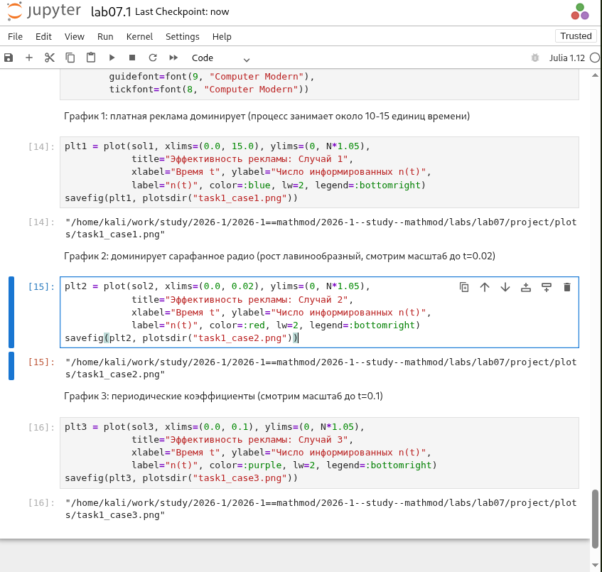

---
## Author
author:
  name: Мурашов Иван Вячеславович
  email: 1132236018@rudn.ru
  affiliation:
    - name: Российский университет дружбы народов
      country: Российская Федерация
      postal-code: 117198
      city: Москва
      address: ул. Миклухо-Маклая, д. 6

## Title
title: "Отчёт по лабораторной работе №7"
subtitle: "Математическое моделирование"
license: "CC BY"
---

# Цель работы

Целью данной лабораторной работы - изучить математическую модель эффективности рекламы (модель Мальтуса с насыщением / логистическое уравнение) и исследовать динамику распространения информации о товаре среди потенциальных покупателей в зависимости от различных соотношений коэффициентов каналов распространения (платной рекламы и «сарафанного радио»).

# Выполнение лабораторной работы

Создаем и проверяем структуру рабочего каталога project ([рис. @fig-001]).

{#fig-001 width=70%}

# Задача №1

Создадим файл lab07.0.jl ([рис. @fig-002]).

{#fig-002 width=70%}

Запустим скрипт ([рис. @fig-003]).

{#fig-003 width=70%}

Создадим производные форматы с помощью скрипта tangle.jl ([рис. @fig-004]).

{#fig-004 width=70%}

Запустим файл ipynb в jupyter-notebook ([рис. @fig-005]).

{#fig-005 width=70%}

# Задача №2

Создадим файл lab07.1.jl ([рис. @fig-006]).

{#fig-006 width=70%}

Запустим скрипт ([рис. @fig-007]).

{#fig-007 width=70%}

Создадим производные форматы с помощью скрипта tangle.jl ([рис. @fig-008]).

{#fig-008 width=70%}

Запустим файл ipynb в jupyter-notebook ([рис. @fig-009]).

{#fig-009 width=70%}

# Выводы

В ходе выполнения лабораторной работы была изучена математическая модель эффективности рекламы (модель Мальтуса с насыщением / логистическое уравнение) и исследована динамику распространения информации о товаре среди потенциальных покупателей в зависимости от различных соотношений коэффициентов каналов распространения (платной рекламы и «сарафанного радио»).
