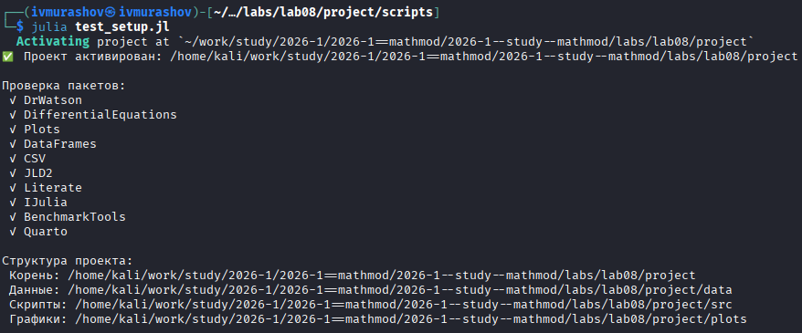
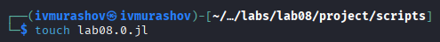
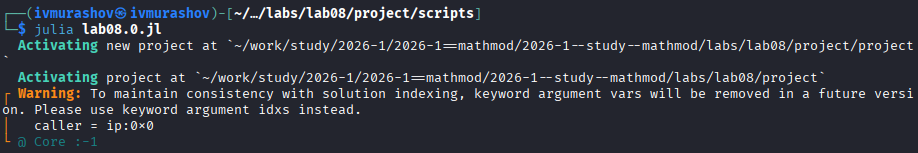
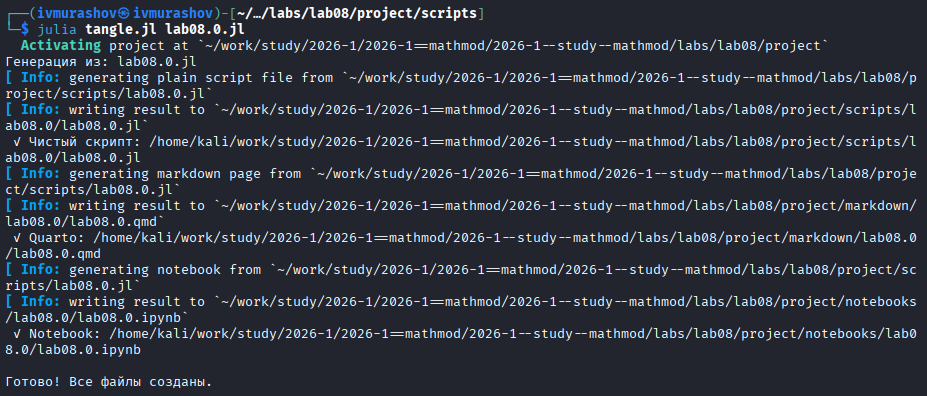
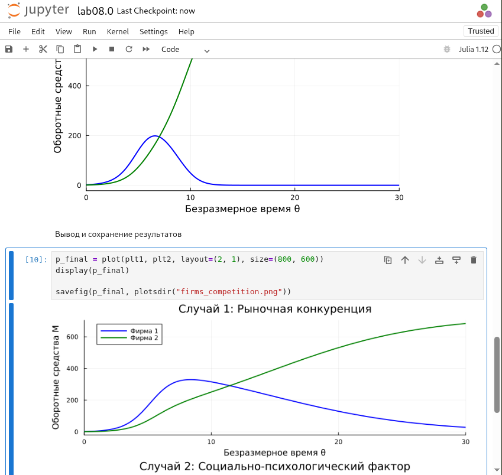
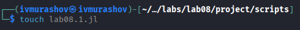
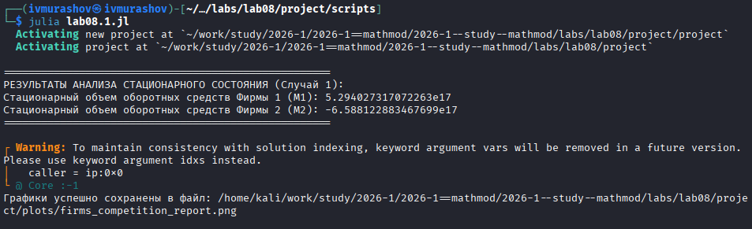
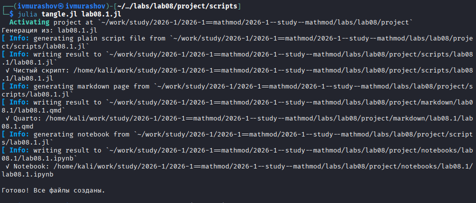
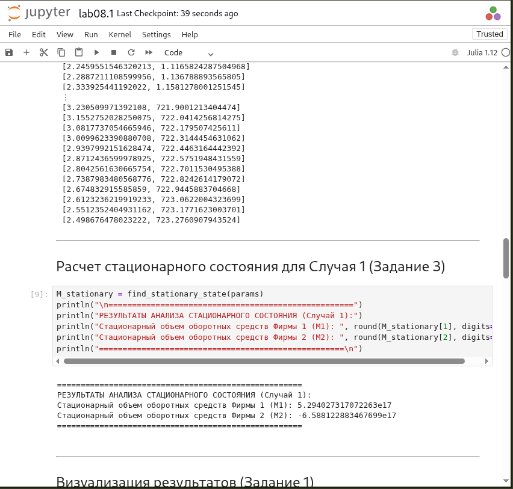

---
## Author
author:
  name: Мурашов Иван Вячеславович
  email: 1132236018@rudn.ru
  affiliation:
    - name: Российский университет дружбы народов
      country: Российская Федерация
      postal-code: 117198
      city: Москва
      address: ул. Миклухо-Маклая, д. 6
## Title
title: Лабораторная работа №8
subtitle: Математическое моделирование
license: CC BY
date: 2026-05-30
date-format: "YYYY-MM-DD"
---

## Цель работы

Цель данной лабораторной работы - изучить математическую модель конкуренции двух фирм, производящих идентичный товар, в условиях замкнутого рынка. Реализовать систему дифференциальных уравнений, описывающих динамику изменения объемов оборотных средств предприятий, для двух сценариев: при чисто рыночной конкуренции и при наличии дополнительных социально-психологических факторов (внешнего регулирования/лоббирования). Аналитически определить стационарное состояние системы и исследовать характер устойчивости рынка с помощью численного моделирования на языке Julia.

## Выполнение лабораторной работы

Создаем и проверяем структуру рабочего каталога project ([рис. @fig-001]).

{#fig-001 width=70%}

## Задача №1

Создадим файл lab08.0.jl ([рис. @fig-002]).

{#fig-002 width=70%}

## Задача №1

Запустим скрипт ([рис. @fig-003]).

{#fig-003 width=70%}

## Задача №1

Создадим производные форматы с помощью скрипта tangle.jl ([рис. @fig-004]).

{#fig-004 width=70%}

## Задача №1

Запустим файл ipynb в jupyter-notebook ([рис. @fig-005]).

{#fig-005 width=70%}

## Задача №2

Создадим файл lab08.1.jl ([рис. @fig-006]).

{#fig-006 width=70%}

## Задача №2

Запустим скрипт ([рис. @fig-007]).

{#fig-007 width=70%}

## Задача №2

Создадим производные форматы с помощью скрипта tangle.jl ([рис. @fig-008]).

{#fig-008 width=70%}

## Задача №2

Запустим файл ipynb в jupyter-notebook ([рис. @fig-009]).

{#fig-009 width=70%}

## Выводы

В ходе лабораторной работы была успешно исследована и реализована на языке Julia динамическая модель конкуренции двух фирм.
Для первого случая (чисто рыночная конкуренция) численное моделирование подтвердило аналитические расчеты: система стремится к единственному устойчивому стационарному состоянию ($M_1 \approx 4.29$, $M_2 \approx 0.17$). Было продемонстрировано, что фирма с меньшей себестоимостью продукции (Фирма 2) способна компенсировать отставание по начальному капиталу и занять свою стабильную нишу на рынке.

Для второго случая было установлено, что добавление социально-психологического фактора (неценового преимущества, создаваемого одной из фирм) нарушает естественный рыночный баланс. Это приводит к перераспределению долей рынка и значительному подавлению оборотных средств конкурирующего предприятия.

Таким образом, цель работы полностью достигнута: освоены методы анализа устойчивости экономических систем и построения фазовых траекторий на основе имитационного моделирования.
